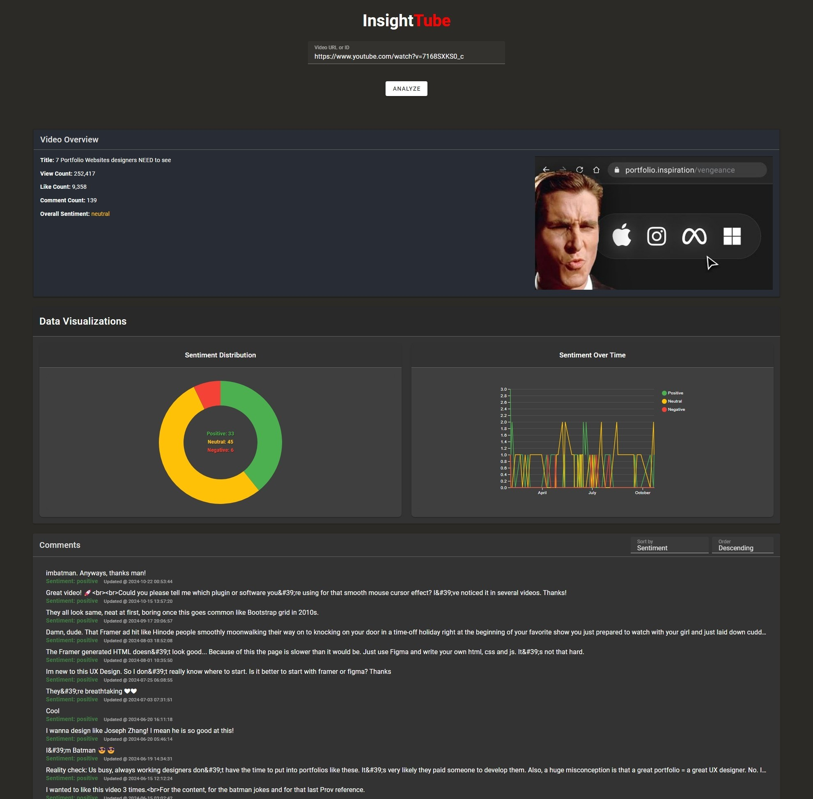

# InsightTube

InsightTube is a web application designed to analyze YouTube video comments using sentiment analysis. The application provides visual insights into viewer sentiment and engagement patterns, helping content creators and analysts better understand their audience's reactions.

<p align="center">
  
</p>

## Overview

InsightTube fetches comments from YouTube videos using the YouTube Data API and performs sentiment analysis to determine whether comments are positive, neutral, or negative. The results are displayed through an intuitive interface featuring interactive data visualizations, making it easy to understand audience sentiment patterns and trends.

## Features

- 🔍 YouTube video analysis by URL or video ID
- 📊 Interactive data visualizations:
  - Sentiment distribution donut chart
  - Sentiment trends over time line chart
- 💬 Comprehensive comment analysis (up to 1000 comments per video)
- 📈 Video statistics overview (views, likes, comments)
- 🎨 Modern, responsive user interface

## Technologies Used

### Frontend
- Vue.js 3
- Vuetify 3
- D3.js for data visualization

### Backend
- Go (Golang)
- YouTube Data API v3
- VADER Natural Language Processing for sentiment analysis

## Installation

### Prerequisites
- Node.js (v14 or higher)
- Go (v1.16 or higher)
- YouTube Data API key

### Getting Started

1. Clone the repository:
```bash
git clone https://github.com/Kylet1699/InsightTube.git
cd InsightTube
```

2. Backend Setup:

```bash
cd backend

echo "YOUTUBE_API_KEY=your_api_key_here" > .env
echo "PORT=8080" >> .env

go mod tidy

go run main.go
```

3. Frontend Setup:

```bash
cd frontend

npm install

npm run serve
```

4. Open your browser and navigate to `http://localhost:8080`

## Usage

1. Launch the application in your web browser
2. Paste a YouTube video URL or video ID into the input field
3. Click "Analyze" to fetch and analyze the video's comments
4. View the generated visualizations and statistics

## Known Issues

- API rate limiting may affect the number of comments that can be fetched
- Some comments may not be properly analyzed due to complex language patterns

## Future Steps

- Enhance analysis features
  - Include comment thread reply analysis to capture complete conversation context
  - Add support for multiple languages
- Data Visualization Improvements
  - Add interactive tooltips to data visualization
  - Add export functionality for graphs and data
  - Include comparison feature for analyzing multiple videos